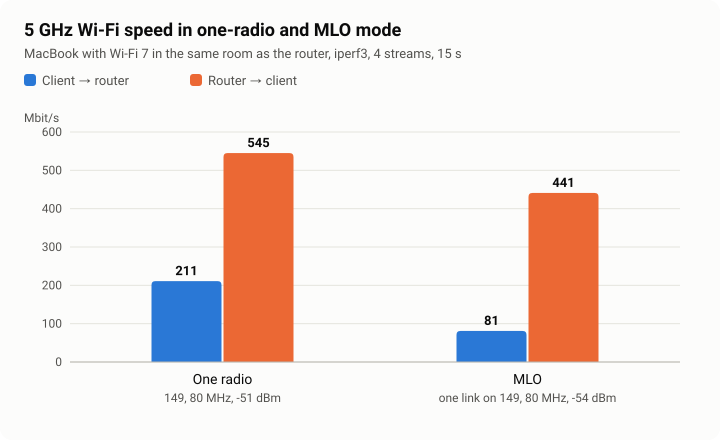

# Measurements

[Русский](benchmarks.md) · [中文](benchmarks.zh.md)

Numbers you can check. Each one says what it was measured with and how, so anyone can repeat it on their own router and compare.

## Method

Wi-Fi. `iperf3 -s` on the router, the Wi-Fi client runs

```
iperf3 -c 192.168.11.1 -P 4 -t 15
iperf3 -c 192.168.11.1 -P 4 -t 15 -R
```

The first line measures client to router, the second router to client. Four streams, 15 seconds, the received total. Router CPU load comes from the same iperf3 report (`remote_total`). Here the router itself receives and sends the traffic, so this is Wi-Fi speed together with its CPU, not routing.

Memory. `MemTotal` and `MemAvailable` from `/proc/meminfo` 10 minutes after boot, with every service of the build and Wi-Fi on both bands.

The conditions go next to the numbers. That is the channel, the width, the signal at the client and the 5 GHz mode. Without them numbers cannot be compared.

## Results

A 1.4.0 test build (OpenWrt main d958caf, kernel 6.18.52), September 30, 2026. The client is a MacBook with Wi-Fi 7 (802.11be), in the same room as the router.

| 5 GHz mode | Client channel | Signal | Client → router | Router → client | Router CPU |
|---|---|---|---|---|---|
| One radio | 149, 80 MHz, EHT | -51 dBm | 211 Mbit/s | 545 Mbit/s | 8 % / 5 % |
| MLO, 36 at 160 MHz and 149 at 80 MHz | 149, 80 MHz, EHT, one link | -54 dBm | 81 Mbit/s | 441 Mbit/s | 6 % / 4 % |



In two-radio and MLO mode the radio firmware splits the four chains of the QCN9274 in half, two per radio. That is why one client is faster in one-radio mode. Two radios and MLO pay off with many clients on different channels. The MacBook joins the MLO network on one link, not as an MLD, so it cannot show two links adding up.

Memory is 881,336 kB in total, 509,712 kB of it available.

## Not measured yet

- Routing and NAT on a wired connection. There is no way to run such a measurement yet.
- A client that joins MLO on two links at once.
- Numbers with hardware NAT offload. Offload is there now (Network, Hardware offload), and the visible gain is expected for wired clients. There is no way to run such a measurement yet. If you can, send a measurement with the method above, with offload and without.
