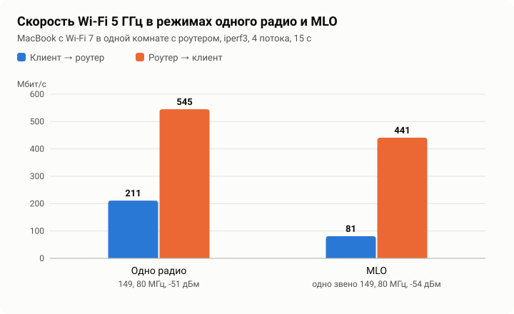

# Замеры

[English](benchmarks.en.md) · [中文](benchmarks.zh.md)

Здесь цифры, которые можно проверить. Для каждой указано, чем и как мерили, чтобы любой мог повторить на своём роутере и сравнить.

## Методика

Wi-Fi. На роутере `iperf3 -s`, клиент по Wi-Fi запускает

```
iperf3 -c 192.168.11.1 -P 4 -t 15
iperf3 -c 192.168.11.1 -P 4 -t 15 -R
```

Первая строка меряет передачу от клиента к роутеру, вторая от роутера к клиенту. Четыре потока, 15 секунд, берётся итог по принятым данным. Загрузка процессора роутера берётся из того же отчёта iperf3 (`remote_total`). В этом замере роутер сам принимает и отдаёт трафик, так что это скорость Wi-Fi вместе с его процессором, а не маршрутизация.

Память. `MemTotal` и `MemAvailable` из `/proc/meminfo` через 10 минут после загрузки, со всеми службами сборки и Wi-Fi на обоих диапазонах.

Рядом с цифрами записываем условия. Это канал, ширина, уровень сигнала у клиента и режим 5 ГГц. Без них цифры сравнивать нельзя.

## Результаты

Тестовая сборка 1.4.0 (OpenWrt main d958caf, ядро 6.18.52), 30 сентября 2026. Клиент MacBook с Wi-Fi 7 (802.11be), в одной комнате с роутером.

| Режим 5 ГГц | Канал клиента | Сигнал | Клиент → роутер | Роутер → клиент | CPU роутера |
|---|---|---|---|---|---|
| Одно радио | 149, 80 МГц, EHT | -51 дБм | 211 Мбит/с | 545 Мбит/с | 8 % / 5 % |
| MLO, 36 на 160 МГц и 149 на 80 МГц | 149, 80 МГц, EHT, одно звено | -54 дБм | 81 Мбит/с | 441 Мбит/с | 6 % / 4 % |



В режиме двух радио и MLO прошивка радиомодуля делит четыре антенных тракта QCN9274 пополам, по два на каждое радио. Поэтому одному клиенту режим одного радио быстрее. Два радио и MLO выгодны, когда клиентов много и они на разных частотах. MacBook подключается к сети MLO одним звеном, а не как устройство MLD, поэтому сложения двух звеньев этим клиентом не проверить.

Памяти всего 881 336 КБ, из них доступно 509 712 КБ.

## Чего пока нет

- Маршрутизация и NAT на проводном подключении. Провести такой замер пока нет возможности.
- Клиент, который подключается к MLO сразу двумя звеньями.
- Замеры с аппаратной разгрузкой NAT. Разгрузка уже есть (Сеть, Аппаратная разгрузка), и заметный выигрыш от неё ожидается на проводных клиентах. Провести такой замер пока нет возможности. Если можете, пришлите замер по методике выше, с разгрузкой и без.
